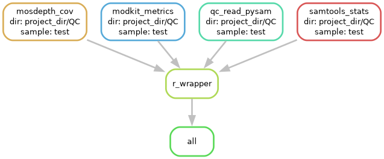

## Pipeline

This pipeline was developed to perform quality control of Fiber-seq
data. It is divided into two parts: base and functional. The pipeline is
based in snakemake version7, which is loaded in the conda enviroment.
`/project/spott/dveracruz/bin/miniconda3/envs/fiber_sq`.

### Conda and Conda environments it depends:

This pipeline assumes that you have conda installed and the following environments are available. 

-   fiber\_sq = `/project/spott/dveracruz/bin/miniconda3/envs/fiber_sq`.
    This environment is used for snakemake7, samtools, python and R.

-   dimelo\_modkit\_parsing =
    `/project/spott/dveracruz/bin/miniconda3/envs/dimelo_modkit_parsing`
    Used mostly for modkit, this is only included in the report for
    Nanopore data, but is always ran.

A yaml file with the conda environment is included in `workflow/conda_env`. You can create your own enviroments and modify the smk files to use them.

### Base metrics

-   Samtools stats: Read length, and coverage.

-   Mosdepth: Coverage-related stats, including coverage per chromosome
    and in total.

-   QC metrics per read:

    -   Read length
    -   Reads length N50
    -   Mean MapQ
    -   Median QV
    -   6mA methylation fraction
    -   5mC methylation fraction

### Functional metrics

-   6mA Methylation fraction in promoters

-   FIREs:

    -   Number of FIREs per sample
    -   Mean FIRE length
    -   Median FIRE length

## Config file

Most variables are shared between the two workflows. The main difference
is that the functional workflow requires a TSS bed file to calculate the
functional metrics at promoters and also BAMs with nucleosomes called.

Use always full paths.

### Base QC: `config_qc.yaml`

    ##  CONFIG FILE: For hifi_bam_qc snakemake workflow.

    ## Reference name: For Records only, but the value does not affect the pipeline. 
    reference: "GRCh38"
    platform: "Nanopore" ## or PacBio

    ## Directory to save the results - FULL PATH
    w_dir: "/project/spott/1_Shared_projects/macrophages_Fiber_seq/QC"

    ## BAM files per samples: BAM should be indexed
    samples:
        MF_control: "/project/spott/1_Shared_projects/macrophages_Fiber_seq/FIRE/bam/MF_control.aligned.sort.filtered.nuc.bam"
        MF_LPS: "/project/spott/1_Shared_projects/macrophages_Fiber_seq/FIRE/bam/MF_LPS.aligned.sort.filtered.nuc.bam"

    ## FIRE directories: Ensure that the names match the ones in samples. 
    fire_dirs:
        MF_control: "/project/spott/1_Shared_projects/macrophages_Fiber_seq/FIRE/results/MF_control"
        MF_LPS: "/project/spott/1_Shared_projects/macrophages_Fiber_seq/FIRE/results/MF_LPS"

### Functional QC: `config_qc_func.yaml`

    ##  CONFIG FILE: For hifi_bam_qc_func snakemake workflow, but also compatible with hifi_bam_qc snakemake workflow. 

    ## Reference name: For Records only, but the value does not affect the pipeline. 
    reference: "GRCh38"
    platform: "Nanopore" ## or PacBio

    ## Directory to save the results - FULL PATH
    w_dir: "/project/spott/1_Shared_projects/macrophages_Fiber_seq/QC_func"

    ## TSS bed file to use for promoters, Choose one of the two available
    ## For a different reference, imitate the format of the one provided.
    TSS: "/project/spott/dveracruz/data/LCL_annotation/TSS/TSS_1kb.bed"  ## HUMAN DATA
    ##TSS:"/project/spott/dveracruz/mini_projects/ArabidopsisT/data/regions/TSS/TSS_1kb.bed" ## Arabidopsis data

    ## BAM files per samples: 
    ## BAM should be indexed & had nucleosomes called with ft add-nucleosomes.
    samples:
        MF_control: "/project/spott/1_Shared_projects/macrophages_Fiber_seq/FIRE/bam/MF_control.aligned.sort.filtered.nuc.bam"
        MF_LPS: "/project/spott/1_Shared_projects/macrophages_Fiber_seq/FIRE/bam/MF_LPS.aligned.sort.filtered.nuc.bam"

    ## FIRE directories: Ensure that the names match the ones in samples. 
    fire_dirs:
        MF_control: "/project/spott/1_Shared_projects/macrophages_Fiber_seq/FIRE/results/MF_control"
        MF_LPS: "/project/spott/1_Shared_projects/macrophages_Fiber_seq/FIRE/results/MF_LPS"

## Pipeline structure

 

## Running pipeline

This pipeline runs in snakemake version 7. Currently, the conda
environment.

### run\_base\_QC.sh / run\_func\_QC.sh

Both scripts are similar, but the functional one requires a config file
like config\_qc\_func.yaml. The current resources are okay for most
samples, including those with high coverage, but you can change the
partition if you need. (caslake or spott)

    #!/bin/bash

    #SBATCH --job-name=Fiberseq-QC
    #SBATCH --output=%x_%j.out
    #SBATCH --error=%x_%j.err
    #SBATCH --time=4:00:00
    #SBATCH --account=pi-spott
    #SBATCH --partition=spott
    #SBATCH --mem=2G
    #SBATCH --nodes=1
    #SBATCH --ntasks-per-node=1

    ## Set configuration file.
    config_file=workflow/config_qc_func.yaml ## $out_dir/config.yaml

    ## Start output: Show start time & configuration. 

    echo Starting Time is `date "+%Y-%m-%d %H:%M:%S"`
    start=$(date +%s)

    ## Check the config file exists. 
    if [ ! -f $config_file ]; then
        echo "Configuration file not found!, expected $config_file"
        exit 1
    fi

    echo Configuration as in $config_file:
    echo Results will be saved in w_dir/sample
    echo -e "\n"
    cat $config_file
    echo -e "\n\n"

    ## Run snakemake pipeline. 
    source activate /project/spott/dveracruz/bin/miniconda3/envs/fiber_sq  

    ## Pipeline path & smk to use. 
    smk=/project/spott/dveracruz/fiberseq_QC/workflow
    ## Pipeline to run: Choose the one you want. 
    pp=hifi_bam_qc_base.smk
    pp=hifi_bam_qc_func.smk

    snakemake -s $smk/$pp --unlock

    snakemake -s $smk/$pp --configfile $config_file \
        --cluster "sbatch --account=pi-spott --partition=caslake --nodes=1 --mem-per-cpu=60000" \
        --jobs 50 --keep-target-files --keep-going --rerun-incomplete

    ## Move logs to log folder. 

    echo Ending Time is `date "+%Y-%m-%d %H:%M:%S"`
    end=$(date +%s)
    time=$(( ($end - $start) / 60 ))
    echo Used Time is $time mins

## Example QC Report

**`/spott/1_Shared_projects/LCL_Fiber_seq/QC/Deep_AL-8/qc_report_func.html`**

Each report includes multiple sections.

## Other output of relevance:

-   `qc_report.html`: HTML report with the QC metrics.
-   `qc_report_func.html`: HTML report with the functional metrics.
-   `promoter_stats.tsv`: Table with average 6mA methylation per TSS.
-   `QC_stats_byRead.tsv`: Summary statistics per read, including read
    length, N50, mean MapQ, median QV, 6mA methylation fraction, and 5mC
    methylation fraction.
-   `sample_summary.tsv`: Table with coverage statistics per chromosome.
    (In older versions, it’s `read_summary.tsv`)
